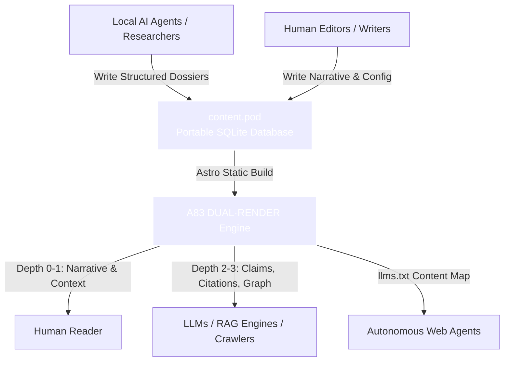

# Strategic Marketing Plan: The Agent-Native Knowledge Stack
## Connecting Orbiter & Dual Render

This marketing plan establishes the combined positioning of **Orbiter** (the portable research CMS) and **Dual Render** (the adaptive, progressive-depth presentation layer) as the default open-source publishing stack for the AI era.

---

## 1. Executive Summary & Core Concept

Currently, websites are designed either for **human attention** (visual, layout-heavy, semantically flat) or **machine API consumption** (headless JSON/GraphQL feeds requiring separate infrastructure). 

The **Agent-Native Knowledge Stack** solves this by unifying both audiences into a single, portable publishing pipeline:
*   **Orbiter (`content.pod`)** acts as the **local structured database** where humans and local AI agents store structured research (using Dossier Schema 2.0: observations, claims, evidence, relationships).
*   **Dual Render (Astro Layer)** acts as the **dual-audience presentation layer** that serves a single DOM. Humans get a beautifully typeset story; AI agents and LLM crawlers get a structured semantic block (Depth 3 / `llms.txt`) with zero container noise.

---

## 2. Positioning & Value Propositions

### Product Positioning
*   **The Narrative:** *"The end of the website as we knew it. If half of your audience doesn't have eyes, typography is only half the battle. Content-Architecture is the new typography."*
*   **Target Audience:** Solopreneurs, technical researchers, AI engineering teams, documentation writers, and forward-looking developers who want their blogs to be highly referenceable by RAG (Retrieval-Augmented Generation) systems.

### Key Value Propositions
| Feature | Audience | Value Proposition |
| :--- | :--- | :--- |
| **Single-File Portability (`.pod`)** | Developers & Researchers | Zero-ops infrastructure. Copy one SQLite file to move your entire CMS, assets, content, and schema. |
| **Progressive Semantic Depth** | Humans & Machines | Users can slide from narrative depth (0) to raw analysis (2). Agents automatically consume raw fact-graphs (3). |
| **Structured RAG Anchors** | AI Agents & LLMs | Native `/llms.txt`, claims tables, and source relationships reduce LLM context distortion and hallucinations when referencing your site. |

---

## 3. The Marketing Strategy

Our strategy is to leverage the developer communities of **Astro**, **SQLite**, and **AI/RAG Engineering** through open-source transparency, technical essays, and interactive demos.

### Stage 1: The Narrative Launch (Hacker News / Dev.to)
Launch with a thought-provoking, deep-dive technical essay.
*   **Article Title:** *"Why We Stopped Designing Websites for Humans Only (And How We Build for AI Agents Now)"*
*   **Core Message:** Explain the concept of the *Dual-Audience Web*. Introduce **Dual Render** as the styling paradigm and **Orbiter** as the open-source tool that enables it.
*   **Hook:** Showcase the `/llms.txt` auto-generation directly from the SQLite database.

### Stage 2: Open Source "Show HN" Launch
Post **Orbiter** on Hacker News as a portable SQLite CMS.
*   **Show HN Title:** *"Show HN: Orbiter – Portable single-file CMS for Astro built on SQLite"*
*   **Visual Assets:** Use a video showing an AI agent updating a `content.pod` file in terminal while a local Astro server live-reloads the changes on a Dual-Render layout.

### Stage 3: The "Seeded Techblog" Demo
Provide a ready-to-run template of the `a83-blog/techblog`.
*   A user runs `npx @a83/orbiter-cli init --template dual-render my-blog`.
*   It boots a fully functional blog with the **Depth Slider (0-3)**, structured dossiers, and semantic inline-reveal links already set up.

---

## 4. Execution Campaigns (Markdown Postings)

To support this launch, we will prepare three campaign folders inside `postctl`:
1.  `campaign-orbiter-launch/`: Focused on SQLite portability, Astro 6 integration, and zero-ops hosting.
2.  `campaign-dual-render/`: Focused on semantic depth, WCAG/Agent accessibility, and LLM-friendly DOMs.
3.  `campaign-dossier-schema/`: Deep-dive into structured publishing (claims, evidence, sources).

### Campaign Schedule
*   **Day 1:** Core Stack Announcement (Suite Intro)
*   **Day 3:** Deep Dive: Why SQLite is the best database for local AI research workflows.
*   **Day 5:** Depth vs. Dark Mode: Showing the progressive disclosure UI in action.
*   **Day 7:** Open Source Release & CLI Init Guide.

---

> [!TIP]
> **Key Metric for Success:** Number of GitHub stars on [aeon022/orbiter](https://github.com/aeon022/orbiter) and index inclusions in community `/llms.txt` directories.
