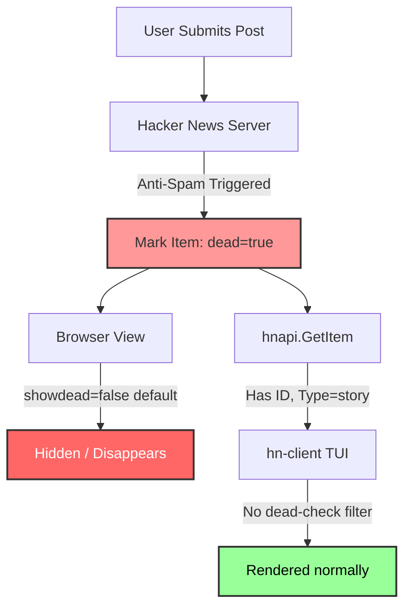

# Audit-Report & Roadmap: Hacker News Client (hn-client)
## Resolving Feed Discrepancy & Moderation Visibility

This report analyzes the discrepancy between the terminal client and the web browser regarding submission visibility, audits the current codebase, and outlines a roadmap to handle HN's moderation states gracefully.

---

## 1. The Discrepancy Audit: Why posts are visible in TUI but not the Browser

When you publish a post that triggers Hacker News's spam protection or is flagged by users:
1.  **Hacker News Database:** The post is marked with `dead: true` in the Firebase DB.
2.  **Web Browser (Default):** HN hides `dead` and `flagged` posts entirely. They disappear from the new/show lists and the user's profile submissions unless the user explicitly enables `showdead` in their HN profile settings.
3.  **Terminal Client (hn-client):** The API wrapper fetches the user's submissions, but the TUI does not check or filter the `Dead` or `Deleted` fields in the story struct. It renders them as active stories, creating the illusion that they are successfully published, while they are actually invisible to the public.

---

## 2. Technical Audit of the Codebase

### Vulnerabilities in `main.go` / `api.go`
*   **Missing Status Validation:** The `fetchStories` loop and comment parser do not evaluate the `Dead` or `Deleted` boolean fields returned by the Firebase API.
*   **Rate-Limit Unawareness:** When submitting or reloading feeds, the client does not capture rate-limiting indicators (such as API latency spikes or empty response payloads).

---

## 3. The Better Idea: Anti-Flagging & Moderation TUI

Instead of just mirroring the Hacker News API blindly, `hn-client` should become **Hacker News-native aware**, protecting developers from silent flags and spam filters.

### Feature 1: Visible Moderation Indicators (TUI Warnings)
If a post is marked `Dead` or `Deleted`, the TUI must clearly label it rather than hiding it or rendering it normally.
*   Add a `[DEAD]` or `[FLAGGED]` tag in orange/red next to the score.
*   Display a warning in the detail view: *"Warning: This submission has been flagged or marked dead by HN moderation."*

### Feature 2: Pre-Flight Submission Audit (Text Analysis)
Since self-promotion is the number one trigger for flags, we can integrate a local linting utility that runs before you write a submission:
*   Flag marketing buzzwords (e.g. *revolutionary*, *ultimate*, *game-changer*, *next-gen*).
*   Check if the title complies with the exact `Show HN` rules.

### Feature 3: TUI "Show Dead" Toggle
Allow users to toggle the visibility of dead posts (similar to the HN profile setting) directly via a hotkey (e.g. `H` for "hidden/dead").

---

## 4. Implementation Roadmap

### Phase 1: Moderation Diagnostics (Immediate Fixes)
- [ ] Update `main.go` render logic to prepend `[DEAD]` to story titles if `item.Dead` is true.
- [ ] Add `showdead` option to `~/.hn-config.json` and toggle key in TUI.
- [ ] If `showdead` is false, filter out `Dead` stories from categories like `"new"` and `"show"`.

### Phase 2: User Submission Guard (Next Sprint)
- [ ] Add a `Mine (Audit)` view that compares your submissions against the public `/newest` and `/show` lists to verify if they are actually visible to the public or have been shadow-banned/flagged.

### Phase 3: CLI Pre-Flight Linting
- [ ] Implement `hn-client lint "Title text"` to verify title tone and formatting before submission.
