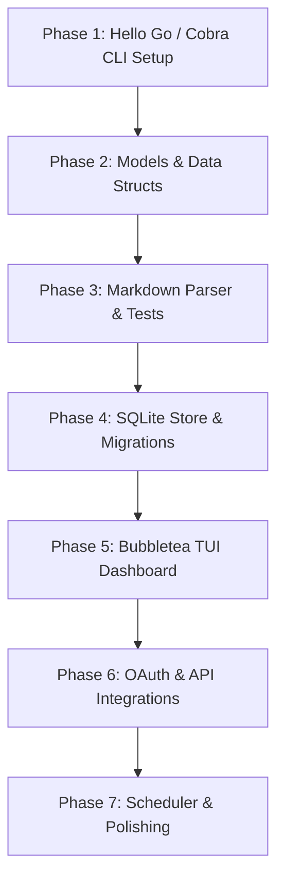

# postctl — Projekt-Fahrplan & Umsetzungskonzept

Dieses Dokument dient als zentrale Orientierung und Statusübersicht für die Entwicklung von **postctl**. Es fasst die Erkenntnisse aus den Quelldokumenten zusammen und bereitet den konkreten Projektablauf vor.

---

## 📖 Dokumenten-Referenzen & Quellen

* **KI-Context**: [KI-CONTEXT.md](file:///Users/gweiher/Developing/Projects/postctl/documents/KI-CONTEXT.md) (Stack, Verzeichnisse, DB-Schema, API-Details, TUI-Entwürfe)
* **Master-Concept**: [MASTER-CONCEPT.md](file:///Users/gweiher/Developing/Projects/postctl/documents/MASTER-CONCEPT.md) (Problem, Lösung, USP, Wettbewerbsanalyse, Monetarisierung)
* **Specification**: [SPEC.md](file:///Users/gweiher/Developing/Projects/postctl/documents/SPEC.md) (Workflows, Markdown-Spezifikation, API-Endpoints, Error Handling)
* **Tutorial**: [TUTORIAL.md](file:///Users/gweiher/Developing/Projects/postctl/documents/TUTORIAL.md) (Didaktischer Pfad mit 7 Phasen, Go-Konzepte vs. JS/TS)

---

## 🎯 Master-Concept & Key Principles

1. **Markdown-First (Single Source of Truth)**: Social-Media-Posts werden als Markdown-Dateien mit YAML-Frontmatter versioniert im Repo gehalten.
2. **Terminal-Native**: Vollständige Bedienung und Vorschau direkt im Terminal mittels TUI ([Bubbletea](https://github.com/charmbracelet/bubbletea)) — kein SaaS/Browser-Zwang.
3. **AI-First Automation (AI-as-Operator)**: CLI-Design ist so optimiert, dass eine KI (wie Antigravity/Claude) als Operator agieren kann:
   * Keine interaktiven Prompts bei Mutationsbefehlen (vollständig steuerbar über Flags).
   * `--format json` für alle Befehle, um Ergebnisse maschinenlesbar zurückzugeben.
   * `--dry-run` zur risikolosen Simulation von Aktionen.
   * Standardisierte Exit-Codes (`0` = Erfolg, `1` = Validierungsfehler, `2` = API-Fehler, `3` = Auth-Fehler).
   * Resumbarkeit: Bei teilweisem Fehlschlag eines Threads kann an der Abbruchstelle fortgesetzt werden.
4. **Single Binary & Offline-First**: Geschrieben in Go, kompiliert in ein einziges Binary mit SQLite (CGO-frei) als lokaler Datenbank.

---

## 🛠 Tech Stack

| Schicht | Technologie | Zweck |
| :--- | :--- | :--- |
| **Sprache** | Go 1.22+ | Performance, Cross-Kompilierung, Concurrency |
| **TUI** | Bubbletea + Lipgloss | Elm-Architektur für interaktives CLI |
| **CLI Parser** | Cobra | Strukturierung der Subcommands |
| **Datenbank** | SQLite (modernc.org/sqlite) | CGO-freies Speichern lokaler Zustände |
| **Konfiguration** | Viper | YAML-Konfiguration & Umgebungsvariablen |
| **Markdown** | goldmark + yaml.v3 | Parsen von Posts und Metadaten |
| **Scheduler** | robfig/cron | In-Process Zeitplanung |

---

## 🚀 Projektablauf (Tutorial & Entwicklungs-Phasen)

Hier ist der strukturierte Ablauf zur schrittweisen Implementierung von **postctl**, abgeleitet aus dem Go-Lernpfad:

### 1. Phase 1: CLI-Grundgerüst & Projekt-Setup (Erledigt ✅)
* **Ziel**: Go Modul initialisieren und CLI-Struktur mit Cobra aufbauen.
* **Dateien**:
  * [main.go](file:///Users/gweiher/Developing/Projects/postctl/main.go)
  * [cmd/root.go](file:///Users/gweiher/Developing/Projects/postctl/cmd/root.go)
* **Konzepte**: Packages, Imports, Cobra-Kommandos, Pointer.

### 2. Phase 2: Modelle & Datenstruktur (Erledigt ✅)
* **Ziel**: Datenmodelle für Posts, Tweets und Kampagnen definieren. Implementierung von `CharCount()` und `IsValid()`.
* **Dateien**:
  * [internal/models/post.go](file:///Users/gweiher/Developing/Projects/postctl/internal/models/post.go)
  * [internal/models/schedule.go](file:///Users/gweiher/Developing/Projects/postctl/internal/models/schedule.go)
* **Konzepte**: Structs, JSON/YAML Tags, Slices, Methoden, Runes (UTF-8).

### 3. Phase 3: Markdown-Parser (Erledigt ✅)
* **Ziel**: Markdown-Dateien einlesen, YAML-Frontmatter trennen, Tweets extrahieren und validieren. Testen via Go-Unit-Tests.
* **Dateien**:
  * [internal/markdown/parser.go](file:///Users/gweiher/Developing/Projects/postctl/internal/markdown/parser.go)
  * [internal/markdown/parser_test.go](file:///Users/gweiher/Developing/Projects/postctl/internal/markdown/parser_test.go)
* **Konzepte**: File I/O, String-Splitting, Regexp, Go Testing, Table-driven Tests.

### 4. Phase 4: SQLite Datenbank & Import (Erledigt ✅)
* **Ziel**: CGO-freie SQLite Datenbank einbinden, Tabellen-Migrations erstellen, CRUD-Operationen bereitstellen und import CLI Befehl umsetzen.
* **Dateien**:
  * [internal/store/db.go](file:///Users/gweiher/Developing/Projects/postctl/internal/store/db.go)
  * [internal/store/posts.go](file:///Users/gweiher/Developing/Projects/postctl/internal/store/posts.go)
  * [internal/store/history.go](file:///Users/gweiher/Developing/Projects/postctl/internal/store/history.go)
  * [internal/store/auth.go](file:///Users/gweiher/Developing/Projects/postctl/internal/store/auth.go)
  * [internal/store/store_test.go](file:///Users/gweiher/Developing/Projects/postctl/internal/store/store_test.go)
  * [internal/config/config.go](file:///Users/gweiher/Developing/Projects/postctl/internal/config/config.go)
  * [cmd/import.go](file:///Users/gweiher/Developing/Projects/postctl/cmd/import.go)
* **Konzepte**: Interfaces, `database/sql` Standardbibliothek, Prepared Statements, `defer` zur Ressourcenfreigabe, AES-256-GCM Verschlüsselung, Viper Konfiguration.

### 5. Phase 5: Terminal UI (TUI) (Erledigt ✅)
* **Ziel**: Interaktives Terminal-Dashboard mit Bubbletea erstellen (Listenansicht, Filter, Tabs, Detailvorschau).
* **Dateien**:
  * [internal/tui/app.go](file:///Users/gweiher/Developing/Projects/postctl/internal/tui/app.go)
  * [internal/tui/styles.go](file:///Users/gweiher/Developing/Projects/postctl/internal/tui/styles.go)
  * [internal/tui/keys.go](file:///Users/gweiher/Developing/Projects/postctl/internal/tui/keys.go)
  * [internal/tui/tabs.go](file:///Users/gweiher/Developing/Projects/postctl/internal/tui/tabs.go)
  * [internal/tui/list.go](file:///Users/gweiher/Developing/Projects/postctl/internal/tui/list.go)
  * [internal/tui/detail.go](file:///Users/gweiher/Developing/Projects/postctl/internal/tui/detail.go)
  * [internal/tui/schedule_view.go](file:///Users/gweiher/Developing/Projects/postctl/internal/tui/schedule_view.go)
  * [internal/tui/history_view.go](file:///Users/gweiher/Developing/Projects/postctl/internal/tui/history_view.go)
  * [cmd/tui.go](file:///Users/gweiher/Developing/Projects/postctl/cmd/tui.go)
* **Konzepte**: Elm-Architektur (Model-Update-View), Keyboard-Events, Component Composition, Lipgloss Styling, Multi-file View Components.

### 6. Phase 6: OAuth & API Integrations (Erledigt ✅)
* **Ziel**: OAuth 2.0 PKCE Authorization Server starten, Tokens abfangen und verschlüsselt speichern. API-Postings zu Twitter/X, LinkedIn und Threads.
* **Dateien**:
  * [internal/platforms/platform.go](file:///Users/gweiher/Developing/Projects/postctl/internal/platforms/platform.go)
  * [internal/platforms/twitter.go](file:///Users/gweiher/Developing/Projects/postctl/internal/platforms/twitter.go)
  * [internal/platforms/linkedin.go](file:///Users/gweiher/Developing/Projects/postctl/internal/platforms/linkedin.go)
  * [internal/platforms/threads.go](file:///Users/gweiher/Developing/Projects/postctl/internal/platforms/threads.go)
  * [internal/platforms/oauth.go](file:///Users/gweiher/Developing/Projects/postctl/internal/platforms/oauth.go)
  * [internal/platforms/dry_run.go](file:///Users/gweiher/Developing/Projects/postctl/internal/platforms/dry_run.go)
  * [cmd/auth.go](file:///Users/gweiher/Developing/Projects/postctl/cmd/auth.go)
  * [cmd/post.go](file:///Users/gweiher/Developing/Projects/postctl/cmd/post.go)
* **Konzepte**: `net/http` Client, Concurrent Postings mit Goroutines & Channels, `context.Context` für Timeouts, OAuth 2.0 Flow mit PKCE, lokale Callbacks, API-Integrationen.

### 7. Phase 7: Scheduler & Polish (Erledigt ✅)
* **Ziel**: Zeitgesteuertes Posten über Cron-Dämon, Graceful Shutdown bei Ctrl+C, Cross-Compilation für Linux/Windows/macOS.
* **Dateien**:
  * [internal/scheduler/scheduler.go](file:///Users/gweiher/Developing/Projects/postctl/internal/scheduler/scheduler.go)
  * [cmd/daemon.go](file:///Users/gweiher/Developing/Projects/postctl/cmd/daemon.go)
  * [cmd/schedule.go](file:///Users/gweiher/Developing/Projects/postctl/cmd/schedule.go)
  * [cmd/list.go](file:///Users/gweiher/Developing/Projects/postctl/cmd/list.go)
* **Konzepte**: `time.Ticker`, `select`, OS Signals, Build Tags, Graceful Shutdown, Background Scheduling Loops.

### 8. Phase 8: Kampagnen-Steuerung (Erledigt ✅)
* **Ziel**: Aggregation von Kampagnen-Statistiken, CLI-Steuerung für Gruppen-Postings und AI-as-Operator Erweiterungen.
* **Dateien**:
  * [cmd/campaign.go](file:///Users/gweiher/Developing/Projects/postctl/cmd/campaign.go)
* **Konzepte**: Subcommand Composition, Gruppen-Verarbeitungen, Aggregierte Abfragen in Go, Side-Effect-freie Simulation (Dry-Run Bugfix).

### 9. Phase 9: AI-Generator (Erledigt ✅)
* **Ziel**: Automatisiertes Einlesen von Webseiten/URLS, Synthetisieren des Inhalts über LLMs (OpenAI, Claude, Ollama) und Generieren plattformspezifischer Markdown-Entwürfe (Twitter-Thread, LinkedIn-Single-Post, Threads-Single-Post) mit YAML-Frontmatter.
* **Dateien**:
  * [internal/generator/scraper.go](file:///Users/gweiher/Developing/Projects/postctl/internal/generator/scraper.go)
  * [internal/generator/scraper_test.go](file:///Users/gweiher/Developing/Projects/postctl/internal/generator/scraper_test.go)
  * [internal/generator/generator.go](file:///Users/gweiher/Developing/Projects/postctl/internal/generator/generator.go)
  * [internal/generator/generator_test.go](file:///Users/gweiher/Developing/Projects/postctl/internal/generator/generator_test.go)
  * [cmd/generate.go](file:///Users/gweiher/Developing/Projects/postctl/cmd/generate.go)
  * [cmd/generate_test.go](file:///Users/gweiher/Developing/Projects/postctl/cmd/generate_test.go)
* **Konzepte**: HTTP-Scraping und HTML-Bereinigung, LLM Integration (System-/User-Prompts, strukturierte JSON-Antworten von OpenAI/Claude/Ollama), YAML-Frontmatter-Generierung, mockbare CLI-Befehlstests.

### 10. Phase 10: AI-Repurposer (Erledigt ✅)
* **Ziel**: Bestehende Posts/Threads aus der Datenbank laden und über LLMs für andere soziale Medienplattformen umschreiben/konvertieren.
* **Dateien**:
  * [internal/generator/repurposer.go](file:///Users/gweiher/Developing/Projects/postctl/internal/generator/repurposer.go)
  * [internal/generator/repurposer_test.go](file:///Users/gweiher/Developing/Projects/postctl/internal/generator/repurposer_test.go)
  * [cmd/repurpose.go](file:///Users/gweiher/Developing/Projects/postctl/cmd/repurpose.go)
  * [cmd/repurpose_test.go](file:///Users/gweiher/Developing/Projects/postctl/cmd/repurpose_test.go)
* **Konzepte**: Wiederverwendung von API-Client-Funktionalitäten mit angepassten System-Prompts zur Umschreibung von Inhalten, Datenbankzugriff und Rekonstruktion von Beitragsinhalten, dynamische YAML-Generierung und Dateiablage.

### 11. Phase 11: Beitrags-Vorlagen / Templates (Erledigt ✅)
* **Ziel**: Generieren strukturierter Markdown-Beiträge mit vorgefertigten Platzhaltern für Produktlaunches, Feature-Updates und Thought-Leadership.
* **Dateien**:
  * [cmd/template.go](file:///Users/gweiher/Developing/Projects/postctl/cmd/template.go)
  * [cmd/template_test.go](file:///Users/gweiher/Developing/Projects/postctl/cmd/template_test.go)
* **Konzepte**: Subcommand Mapping in Cobra, Einbetten statischer Text-Assets, automatische Pfad- und Dateierstellung.

### 12. Phase 12: Interaktions-Statistiken / Analytics (Erledigt ✅)
* **Ziel**: Abrufen und Konsolidieren von Post-Interaktionsdaten (Likes, Shares, Comments, Impressions) direkt von APIs und Visualisierung im Terminal via ASCII-Barcharts.
* **Dateien**:
  * [internal/models/analytics.go](file:///Users/gweiher/Developing/Projects/postctl/internal/models/analytics.go)
  * [cmd/analytics.go](file:///Users/gweiher/Developing/Projects/postctl/cmd/analytics.go)
  * [cmd/analytics_test.go](file:///Users/gweiher/Developing/Projects/postctl/cmd/analytics_test.go)
* **Konzepte**: Datenaggregation über unterschiedliche API-Schnittstellen hinweg, Sparklines / Terminal-Visualisierung, Zeitreihenfilterung.

### 13. Phase 13: TUI Integration der AI-Features (Erledigt ✅)
* **Ziel**: Steuerung der Repurpose-AI direkt aus dem Bubbletea Dashboard.
* **Dateien**:
  * [internal/tui/app.go](file:///Users/gweiher/Developing/Projects/postctl/internal/tui/app.go)
  * [internal/tui/keys.go](file:///Users/gweiher/Developing/Projects/postctl/internal/tui/keys.go)
  * [internal/tui/detail.go](file:///Users/gweiher/Developing/Projects/postctl/internal/tui/detail.go)
  * [internal/tui/history_view.go](file:///Users/gweiher/Developing/Projects/postctl/internal/tui/history_view.go)
* **Konzepte**: Asynchrone Bubbletea-Kommandos (`tea.Cmd`) zur Kommunikation mit LLM-Clients im Hintergrund, dynamisches TUI-Feedback (Statusnachrichten), Keybinding-Mappings.

### 14. Phase 14: CLI Konfiguration / Config (Erledigt ✅)
* **Ziel**: Verwalten der Systemeinstellungen (z. B. AI-Provider, Model, Dry-Run-Flag, DB-Pfad) direkt über das Terminal.
* **Dateien**:
  * [internal/config/config.go](file:///Users/gweiher/Developing/Projects/postctl/internal/config/config.go)
  * [cmd/config.go](file:///Users/gweiher/Developing/Projects/postctl/cmd/config.go)
  * [cmd/config_test.go](file:///Users/gweiher/Developing/Projects/postctl/cmd/config_test.go)
* **Konzepte**: Modifizierbare Konfigurationsstrukturen mit automatischer Serialisierung in YAML, Sicherheitsmaskierung sensibler Anmeldedaten (API-Keys), mockbare Konfigurationsschreibtests.

### 15. Phase 15: TUI Einstellungen & Mehrsprachigkeit (Erledigt ✅)
* **Ziel**: Interaktives Ändern und Speichern von Einstellungen innerhalb des TUI-Dashboards über eine neue Tab-Ansicht sowie Unterstützung für Mehrsprachigkeit (Deutsch und Englisch).
* **Dateien**:
  * [internal/tui/tabs.go](file:///Users/gweiher/Developing/Projects/postctl/internal/tui/tabs.go)
  * [internal/tui/settings_view.go](file:///Users/gweiher/Developing/Projects/postctl/internal/tui/settings_view.go)
  * [internal/tui/app.go](file:///Users/gweiher/Developing/Projects/postctl/internal/tui/app.go)
  * [internal/tui/i18n.go](file:///Users/gweiher/Developing/Projects/postctl/internal/tui/i18n.go)
* **Konzepte**: Dynamisches Hinzufügen von Tab-Elementen in Bubbletea, zyklische Wertänderungen im UI-Zustand durch Tastendruck, automatische Dateisynchronisation, Übersetzungs-Mapping (Tr-Helper) basierend auf der Sprach-Einstellung ("de" / "en").

### 16. Phase 16: Git & GitHub Setup (Erledigt ✅)
* **Ziel**: Versionierung des Projekts initialisieren und den Code auf GitHub bereitstellen.
* **Erledigte Schritte**:
  * Git initialisiert und alle notwendigen Projektdateien committet.
  * Eine [.gitignore](file:///Users/gweiher/Developing/Projects/postctl/.gitignore) wurde angelegt, um Binaries und die SQLite-Datenbank auszuschließen.
  * Ein privates GitHub-Repository über die GitHub CLI (`gh`) erstellt und der lokale Code dorthin gepusht (`https://github.com/aeon022/postctl`).

### 17. Phase 17: AES-Backups & Multi-Geräte-Sync (Erledigt ✅)
* **Ziel**: Ermöglichen der sicheren Synchronisation der lokalen SQLite-Datenbank und der Konfigurationsdatei über andere Geräte (z. B. via Git).
* **Erledigte Schritte**:
  * Krypto-Backup-Modul implementiert (AES-256-GCM mit PBKDF2 Schlüsselableitung).
  * CLI-Subcommands `config export` und `config import` mit Passwortabfragen erstellt.
  * Integration in die TUI-Settings zum fliegenden Pausieren, Ausführen und Fortsetzen.

### 18. Phase 18: TUI-zu-CLI-Übergänge & Finder Drag-and-Drop (Erledigt ✅)
* **Ziel**: Sauberer Wechsel aus der TUI in interaktive CLI-Vorgänge und komfortable Dateipfad-Eingaben für macOS Finder-Nutzer.
* **Erledigte Schritte**:
  * Vollständiges Terminal-Clearing vor interaktiven Prompts (Viewport & Scrollback-Buffer).
  * Bereinigen von Pfad-Anführungszeichen, die Terminals beim Ziehen von Finder-Objekten setzen.
  * Integration von Hilfestellungen und Erfolgsbestätigungen mit Warte-Prompts.

### 19. Phase 19: Integrierter TUI Dokumenten-Browser (Erledigt ✅)
* **Ziel**: Direktes Lesen der vollständigen `README.md` Dokumentation innerhalb des TUI-Dashboards ohne Browser-Zwang.
* **Erledigte Schritte**:
  * Go-Embedding der Dokumentation zur Compile-Zeit.
  * Dynamisch mitskalierendes Split-Layout (Inhaltsverzeichnis + Inhalt-Viewport).
  * Emojis für fehlerfreie Box-Rahmen herausgefiltert und Mausrad-Scrolling integriert.
  * Schnellsprung-Verknüpfungen (TOC-Auswahl, `t`/`Backspace` zurück zum Anfang) implementiert.

### 20. Phase 20: TUI Postings-Editor (Erledigt ✅)
* **Ziel**: Einen interaktiven Editor direkt in das TUI-Dashboard integrieren, um Markdown-Beiträge direkt in der Anwendung verfassen, bearbeiten und in der SQLite-Datenbank speichern zu können.
* **Erledigte Schritte**:
  * Einbinden der Charmbracelet-Module `textinput` und `textarea` für mehrzeilige Editierfunktionen.
  * Editor-Maske mit Feldern für Plattform, Kampagne, Planungsdatum, Bild-Pfade und Beitrags-Text.
  * Formular-Navigation via Tab/Shift+Tab und Tastenfeld-Validierung für Plattformen und Planungsdatum.
  * Speichern und Aktualisieren der Posts direkt in der SQLite-Datenbank (inkl. Aufteilung von Twitter-Threads über `---`).
  * Integration der Tastatur-Shortcuts `n` (neu) und `e` (bearbeiten) im Dashboard, in der Beitragsliste und in der Detailansicht.
  * **Neovim/Vim-Integration**: Unterstützung für das Bearbeiten des Beitragsinhalts im externen Systemeditor (standardmäßig Neovim/Vim) über `ctrl+v` (inklusive eines dynamischen Zeichen-Lineals und Längen-Updates als Markdown-Kommentar am Dateianfang).

### 21. Phase 21: Mastodon-Plattform-Integration (Erledigt ✅)
* **Ziel**: Mastodon als vierte Plattform hinzufügen, um dezentrales Posten, dynamische App-Registrierung, OAuth, Threads und echtes Engagement-Tracking zu unterstützen.
* **Erledigte Schritte**:
  * Konfiguration in `config.go` um Mastodon-Instanz-URL und Client-Credentials erweitert.
  * Implementierung von `internal/platforms/mastodon.go` zur Abwicklung von dynamischer App-Registrierung, sicherem OAuth-Flow, Medientransfer (Bild-Uploads), Thread-Verkettung (Reply-Chaining) und Live-Analytics via API.
  * Integration in die TUI (Dashboard, Einstellungsmenü zur interaktiven Authentifizierung per Tastendruck und Beitrags-Editor inklusive Thread-Unterstützung).
  * Aktualisierung der Landing Page und Testabdeckung im Markdown-Parser.

